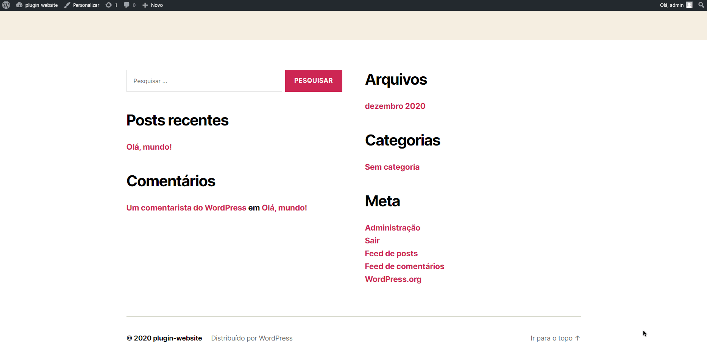

# Social Media Tracker - YT

A partir de agora é possível acompanhar suas inscrições por meio deste widget em wordpress.

## Como instalar

Navegue para o diretório de plugins do seu projeto em wordpress e execute o seguinte comando:

```bash
cd wp-content/plugins
git clone https://github.com/jvbs/socialmediatracker.git
```

E pronto, o plugin já estará instalado, basta ativa-lo no menu administrativo ```Plugins``` > ```Ativar SocialMediaTracker YT```.

## Como utilizar


